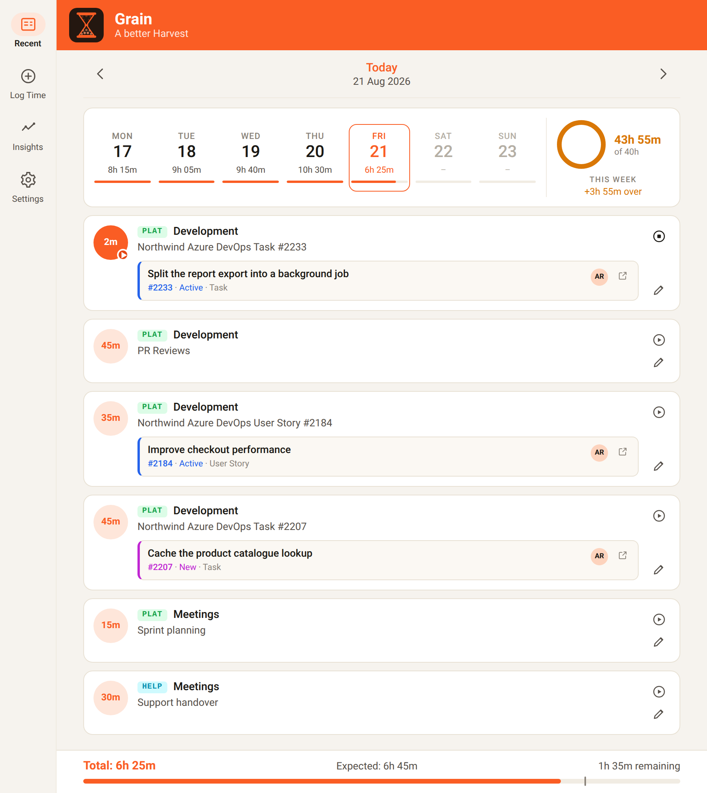
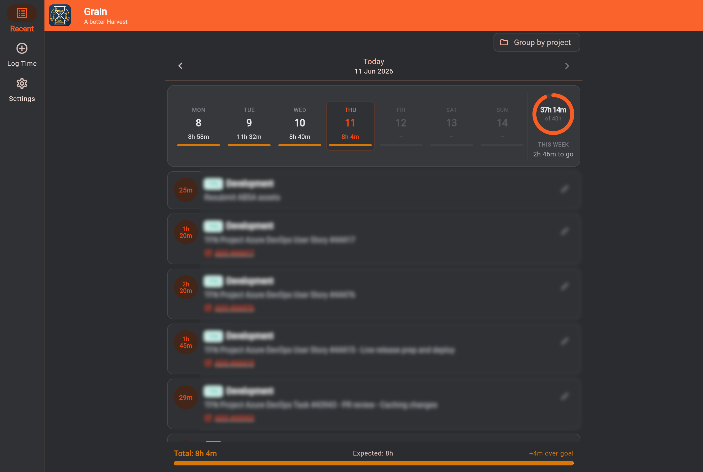

# Grain
### A better Harvest

A personal Flutter app for logging time entries to [Harvest](https://www.getharvest.com/) with first-class Azure DevOps integration. Runs as a **web app** and an **Android APK**.

| Light                                            | Dark                                           |
| ------------------------------------------------ | ---------------------------------------------- |
|  |  |

## Features

### Log Time
- **Project & task selection** — loads your assigned projects and tasks from the Harvest API; responsive layout places the two dropdowns side-by-side on wide screens
- **Default project & task** — configure defaults in Settings so the form is pre-filled on load
- **Hours & minutes input** — pick hours (0–24) and minutes in 5-minute intervals
- **Duration or Start & End** — log a plain duration, or pick start and end times; when your Harvest account tracks time by clock times, those are sent through and power the Insights gap analysis
- **Date picker** — log time against any past date, defaulting to today
- **Start a timer** — instead of logging a fixed duration, start Harvest's own timer and stop it when you're done; because it is Harvest's timer and not a local one, it shows as running in Harvest's web and mobile apps too. Works on duration-tracking accounts — hours accrue while it runs
- **Quick templates** — one-tap chips for the work you log most often ("PR Reviews", "Standup"), each with a preset project, task and default notes; tapping one fills the form without submitting anything
- **Work item mapping rules** — when a linked ADO work item resolves, the first matching rule selects the Harvest project and task for you, with a banner naming the rule and an Undo

### Azure DevOps Integration
- **Configurable ADO instances** — add any number of Azure DevOps project URLs in Settings; select the active instance via a styled segmented button with PAT-status dots
- **PAT authentication** — store a Personal Access Token per instance (stored in `localStorage`, never committed); instances with a configured PAT show a green dot
- **Work item search** — the search icon on the Work Item # field opens a picker over everything assigned to you, so you no longer need to know the number. Matches id, title, type, state, project or tag (`#123` and `123` both work, and `483` finds `13483`); **Tree** view nests Tasks under their User Story and keeps a matched Task's parent for context, **Flat** lists them plainly
- **Status filter** — board-style chips with per-state counts, derived from your project's own process rather than a fixed list; finished work never appears, and a state that dominates the backlog is held back from the default view but stays one tap away
- **Live work item preview** — type a work item number and see title + state fetched from ADO in real time (debounced 600 ms)
- **Work item chip** — ADO-linked entries display a compact inline card with a 3 px colour-coded state stripe, `#id · state · type`, and the creator's avatar (photo when available, initials fallback)
- **Auto-prefixed notes** — notes are automatically prefixed, e.g. `Transport Azure DevOps User Story #13483 - your notes`
- **Clickable work item cards** — tapping the chip opens the work item in ADO in a new tab
- **Native Harvest composite IDs** — entries are saved with the correct `AzureDevOps_{guid}_{type}_{id}` format that Harvest's own ADO integration uses, so time entries appear in the Harvest widget inside Azure DevOps
- **Automatic GUID detection** — the Harvest connection GUID is learned automatically from any natively-created entry and persisted to `localStorage`; no manual configuration needed
- **GUID visibility & manual override** — each ADO instance in Settings shows its current GUID (green when known, orange when not); a pencil icon lets you paste the correct GUID manually
- **Completed Work sync** — when a time entry is saved against an ADO work item, the work item's **Completed Work** field is automatically updated: logging 1 h against a ticket that already has 0.5 h recorded results in 1.5 h; editing an entry applies only the hours delta so there's no double-counting; can be disabled per-instance in Settings
- **Manual Completed Work push** — a timed entry is never synced automatically, since nothing was pushed when its timer started. Stopping a timer offers **Sync to ADO** on the snackbar, and Edit Time carries the same action for any linked entry; both confirm the before and after first, so nothing is added twice by accident
- **Single-instance auto-select** — when only one ADO instance is configured, it is selected automatically on the Log Time and Edit screens

### Recent Entries
- **Default landing screen** — the app opens directly on today's entries
- **New day banner** — if a background refresh detects the date has rolled over while you were viewing "today", a banner appears offering a one-tap jump to the new day
- **Weekly summary strip** — compact Mon–Sun strip showing each day's total; tap any day to navigate; selected day is highlighted
  - **Compact mode** (narrow): day abbreviation + hours columns with a `WeeklyProgressRing` at the end
  - **Emphasized mode** (wide): full day-tile card grid with date number, hours, and a 3 px progress bar per day
- **Weekly progress ring** — animated circular arc showing week total vs. goal; brand-orange fill, switches to amber when over goal; center label shows `Xh Ym / of 40h`; "THIS WEEK" caption with contextual helper text (`Xh to go`, `Goal met`, `+Xh over`); over-goal state moves the label beside the ring for visual emphasis
- **Daily view** — browse entries by day with prev/next navigation and a date picker
- **Daily progress bar** — visual indicator of daily progress toward a configurable goal (derived from work day start/end/break settings); shows overflow in amber; when viewing today, displays an **expected hours** tick marker on the bar and an "Expected: Xh Ym" label based on how much of the work day has elapsed
- **Stop & continue** — a running entry counts up live on its card with a Stop button; any stopped entry can be resumed with Continue. Harvest allows one running timer per user, so Continue is disabled while another is going
- **Edit entries** — tap the pencil icon to open a pre-filled edit form with an orange context banner showing the duration and entry ID; changes are saved via `PATCH` and reflected immediately
- **Delete entries** — tap the trash icon in the Edit Entry screen to permanently remove an entry after confirmation

### Insights
Day analytics for whichever date is selected on Recent — navigating the date on either screen moves the other.

- **Stat tiles** — hours logged against the daily goal, coverage as a percentage, and how much of the day is still unaccounted for (or how far past the goal you are)
- **Where it went** — per project · task totals, largest first, with bars in each project's colour
- **Gap analysis** — when your entries carry clock times, a timeline of the work day plus every uncovered stretch at or above a configurable threshold, with the longest called out. Overlapping entries are merged so double-logged time counts once, and on today the window stops at *now*, so an afternoon that hasn't happened yet isn't counted as dead time
- **Context switches** — how many times you changed project or task, counted from actual changes rather than from simply logging twice
- **Degrades honestly** — a Harvest account that tracks by duration records how long you worked but not when, so the totals, coverage and breakdown still work and the screen explains why the gap list is unavailable

### Visual Design
- **Grain logo** — custom SVG hourglass-and-grain icon; shown in the app bar header (rounded corners) and used as the Android launcher icon and web favicon
- **Light & dark themes** — every palette ships both; switch between **System / Light / Dark** in Settings, persisted across sessions
- **Colour palettes** — pick the look of the whole interface in Settings → Appearance: **Grain** (warm paper, brand orange), **Modern Slate** (cool neutrals), **Deep Indigo**, **Emerald Earth** or **Warm Sand**. Each card previews the palette in the mode you're currently in. Contrast ratios for every palette are asserted by tests, not eyeballed
- **Design token system** — `HarvestTokens` defines brand orange and ADO state colours; surfaces, borders, and text inks come from `HarvestPalette` (a `ThemeExtension` with light and dark variants), so every component is theme-aware — no raw hex values in widgets
- **Duration pill** — 44 px circular pill in the leading position of every entry card; tabular-mono hours label; brand tint background; turns solid orange with a small play-arrow badge (bottom-right) when the timer is actively running
- **Project colour chips** — each project is auto-assigned one of 12 colours (persisted); shown as a short code badge on entry cards and used for the Insights breakdown bars
- **Responsive shell** — wide screens (≥ 720 dp) use a `NavigationRail` sidebar; narrow screens use a `NavigationBar`; content is max-width constrained at 760 dp
- **System insets** — content clears the Android gesture bar and a landscape notch, so nothing hides under the system chrome

### Background Auto-refresh
- Entries logged externally appear automatically without a manual refresh
- Refresh interval is configurable in Settings: 5 min, 15 min, 30 min, or 1 hour (default 15 min)
- Refreshes are silent — no spinner or interruption while you're actively using the app
- Skipped automatically if a submit, update, or delete is in progress to prevent conflicts

### Settings
- All credentials and ADO instances persist in browser `localStorage` and take effect immediately without recompiling
- **Theme** — System / Light / Dark segmented toggle (default System)
- **Project Categories** — view and customise the colour and short code assigned to each project; 12-colour palette with an edit dialog
- **Weekly Goal** — set your target hours per week (used by the progress ring and emphasized strip)
- **Work Day** — configure start time (default 08:30), end time (default 17:00), and break hours (default 0.5 h); the daily goal is derived automatically as `(end − start) − break`; also sets the gap threshold Insights reports against (default 15 min)
- **Work Item Mapping Rules** — named, prioritised rules that pick the Harvest project and task from a linked work item. Conditions match on project, area or iteration path, type, state, tags, title, assignee or id, with `equals` / `contains` / `starts with` / `regex` / `is one of` / `is under path` operators, each negatable; conditions are ANDed and the first matching enabled rule wins. An optional note template prefills the notes field, expanding `{id} {title} {type} {state}` and friends. Drag to reorder, toggle rules individually, or switch auto-apply off entirely
- **Quick Templates** — manage the Log Time chips: label, project, task, default notes, icon and colour, with a live preview and drag-to-reorder
- **Background Refresh** — configure how often the app silently re-fetches the current week's entries
- **Clear Cache & Refresh** — force-reloads time entries from the Harvest API
- **Migrate ADO References** — upgrades current-week entries from plain numeric external reference IDs to the correct native composite format; also repairs entries saved with the wrong GUID or a corrupted ID; scans the past 28 days for native Harvest entries to learn the correct GUID

## Project Structure

```
lib/
├── main.dart
├── config/
│   ├── app_config.dart                   # credentials & default ADO instances (gitignored)
│   └── app_config.example.dart           # template — copy to app_config.dart and fill in
├── models/
│   ├── ado_work_item.dart
│   ├── day_insights.dart                 # pure day analytics — gaps, coverage, context switches
│   ├── mapping_rule.dart                 # work item → project/task rules + matcher (pure)
│   ├── project_assignment.dart
│   ├── project_category.dart             # colour/code model for project chips
│   ├── quick_template.dart               # one-tap Log Time presets
│   ├── time_entry.dart
│   └── work_item_search.dart             # work item search, parent/child tree, state filters (pure)
├── services/
│   ├── ado_service.dart                  # ADO REST API — work item fetch, WIQL search, cache
│   └── harvest_service.dart              # Harvest API v2
├── providers/
│   ├── ado_instance_provider.dart        # ADO instances (localStorage)
│   ├── assignment_provider.dart          # selected project/task & defaults
│   ├── mapping_rule_provider.dart        # mapping rules + auto-apply toggle (localStorage)
│   ├── project_category_provider.dart    # 12-colour palette, weekly goal, work day settings (localStorage)
│   ├── quick_template_provider.dart      # quick templates (localStorage)
│   ├── theme_mode_provider.dart          # System / Light / Dark preference (localStorage)
│   └── time_entry_provider.dart          # entry list, submit/update lifecycle
├── screens/
│   ├── home_screen.dart                  # NavigationRail (wide) / NavigationBar (narrow)
│   ├── edit_time_screen.dart             # pre-filled edit form with orange context banner
│   ├── insights_screen.dart              # day analytics — stat tiles, breakdown, gaps
│   ├── log_time_screen.dart
│   ├── recent_entries_screen.dart        # day picker, week strip, entry list
│   └── settings_screen.dart              # credentials, categories, ADO instances, rules, templates
├── theme/
│   ├── grain_theme.dart                  # builds light/dark ThemeData from the chosen palette
│   ├── harvest_palette.dart              # surfaces, borders, inks and the accent — ThemeExtension
│   ├── harvest_tokens.dart               # tokens stable across palettes — semantic & ADO state colours, breakpoints
│   └── theme_palettes.dart               # the five selectable palettes, light + dark
├── utils/
│   ├── open_url.dart                     # cross-platform URL opener (conditional import)
│   ├── open_url_stub.dart
│   └── open_url_web.dart
└── widgets/
    ├── duration_pill.dart                # circular hours pill (leading slot of entry card)
    ├── error_banner.dart
    ├── mapping_rule_editor.dart          # settings rule list + add/edit dialog
    ├── project_task_selector.dart        # responsive project + task dropdowns
    ├── quick_template_bar.dart           # Log Time chip row
    ├── quick_template_editor.dart        # settings template list + add/edit dialog
    ├── time_entry_card.dart              # entry card — DurationPill + project chip + WorkItemChip
    ├── weekly_progress_ring.dart         # animated circular week-progress arc
    ├── work_item_chip.dart               # compact inline ADO card (state stripe, avatar)
    ├── work_item_picker.dart             # searchable work item dialog (tree/flat, status chips)
    └── work_item_preview.dart            # full-size ADO work item preview card

test/                                     # pure logic only — no widget tests beyond a placeholder
├── day_insights_test.dart
├── mapping_rule_test.dart
├── quick_template_test.dart
├── widget_test.dart
└── work_item_search_test.dart
```

## Setup

### 1. Prerequisites

- [Flutter SDK](https://docs.flutter.dev/get-started/install) (web + Android support enabled)
- A [Harvest personal access token](https://id.getharvest.com/developers)
- (Optional) Azure DevOps Personal Access Token with **Read** access to Work Items — add **Write** if you want Completed Work sync
- (Android) Android SDK / Android Studio for the APK build

### 2. Configure credentials

The app will not compile without `lib/config/app_config.dart`. It is gitignored — never commit it. Copy the template and fill in your own values:

```bash
cp lib/config/app_config.example.dart lib/config/app_config.dart
```

| Field                 | Required | Where to get it                                                                 |
| --------------------- | -------- | ------------------------------------------------------------------------------- |
| `defaultToken`        | Yes      | Harvest personal access token — <https://id.getharvest.com/developers>          |
| `defaultAccountId`    | Yes      | Shown next to the token on the same developers page                             |
| `userId`              | Yes      | Your numeric Harvest user ID — `GET https://api.harvestapp.com/v2/users/me`     |
| `userAgent`           | Yes      | Any `Name (email)` string identifying you to the Harvest API                    |
| `baseUrl`             | Yes      | Leave as `https://api.harvestapp.com/v2`                                        |
| `defaultAdoInstances` | No       | Azure DevOps project URLs to pre-load; leave empty and add via Settings instead |

> **Note:** for ADO instances, `/_workitems/edit/{id}` is appended automatically — only provide the project base URL.

### 3. Set up the Android release keystore

Only needed for `flutter build apk` — skip it if you are working on web alone.

The release build refuses to fall back to the debug keystore, because a debug key is generated per machine: an APK signed with one can only ever be updated from that same machine, and the uninstall a mismatch forces wipes every preference the app holds.

Generate a keystore once, and keep it somewhere you will still have it in a year — lose it and no future build can update an installed Grain:

```bash
keytool -genkey -v -keystore ~/grain-release.jks \
  -keyalg RSA -keysize 2048 -validity 10000 -alias grain
```

Then point the build at it. `android/key.properties` is gitignored, as are `*.jks` and `*.keystore` — never commit either:

```bash
cp android/key.properties.example android/key.properties
```

| Field           | Value                                                          |
| --------------- | -------------------------------------------------------------- |
| `storeFile`     | Path to the `.jks` — absolute, or relative to `android/`        |
| `storePassword` | The keystore password you chose                                 |
| `keyAlias`      | `grain`, unless you passed a different `-alias`                 |
| `keyPassword`   | The key password (`keytool` lets this match the store password) |

### 4. Install dependencies & run

```bash
flutter pub get
flutter run -d web-server --web-port=8080
```

Then open `http://localhost:8080` in Chrome.

### 5. Run the tests

```bash
flutter test
flutter analyze
```

Coverage is deliberately limited to the pure logic — mapping rules, day analytics, quick templates and work item search — which is where the behaviour worth pinning lives. The UI has no widget tests beyond a placeholder.

### 6. Build for production

Both targets should be built together:

```bash
# Web
# MSYS_NO_PATHCONV=1 prevents Git Bash on Windows from expanding /grain/ to a Windows path
# --pwa-strategy=none disables the service worker (avoids fetch/message-channel conflicts)
MSYS_NO_PATHCONV=1 flutter build web --release --base-href /grain/ --pwa-strategy=none

# Android APK
# Output: build/app/outputs/flutter-apk/app-release.apk
flutter build apk --release
```

Serve the `build/web` directory from any static host.

The APK is signed with your own release keystore (step 3) and side-loaded — there is no Play Store listing. Install it directly on a device (`adb install build/app/outputs/flutter-apk/app-release.apk`, or copy the file over and open it).

Releases up to and including `v1.1.0` were signed with the per-machine Android debug key. Android will not install a keystore-signed build over one of those, so the first upgrade past `v1.1.0` needs the old app uninstalled first — which clears its settings, since everything Grain stores lives in app preferences. Note the Harvest token, ADO instances and any mapping rules before uninstalling.

## Settings Reference

All settings persist in browser `localStorage`:

| Setting                  | Description                                                                                      |
| ------------------------ | ------------------------------------------------------------------------------------------------ |
| Theme                    | System / Light / Dark (default System)                                                           |
| Colour Palette           | Grain / Modern Slate / Deep Indigo / Emerald Earth / Warm Sand (default Grain)                   |
| API Token                | Harvest personal access token                                                                    |
| Account ID               | Harvest account ID                                                                               |
| Default Project          | Pre-selected project on the Log Time screen                                                      |
| Default Task             | Pre-selected task for the default project                                                        |
| Weekly Goal              | Target hours per week — used by the progress ring and emphasized week strip                      |
| Work Day Start           | Start of your work day (default 08:30); used to derive the daily goal and expected hours         |
| Work Day End             | End of your work day (default 17:00)                                                             |
| Break Hours              | Total break time per day (default 0.5 h); subtracted from the work day span to get the daily goal |
| Report Gaps Of At Least  | Smallest uncovered stretch Insights lists as a gap (5 / 10 / 15 / 30 / 60 min; default 15 min)   |
| Project Categories       | Customise the colour and short code badge for each project                                       |
| Work Item Mapping Rules  | Rules that pick the Harvest project/task from a linked ADO work item; drag to reorder, toggle individually, or switch auto-apply off |
| Quick Templates          | One-tap Log Time presets — label, project, task, notes, icon and colour; drag to reorder          |
| Background Refresh       | How often the app silently re-fetches the current week (5 / 15 / 30 / 60 min; default 15 min)  |
| ADO Instances            | Add, edit, or remove Azure DevOps project URLs                                                   |
| PAT (per ADO)            | Personal Access Token for each ADO instance — enables work item fetch                            |
| Harvest GUID (per ADO)   | The Harvest connection GUID shown per instance with green/orange status; editable manually       |
| Update Completed Work    | When enabled (default on), automatically adds logged hours to the ADO work item's Completed Work field; edits apply only the delta. Timed entries are pushed manually instead, from the stop snackbar or Edit Time |
| Clear Cache & Refresh    | Discards cached time entries and reloads from the Harvest API                                    |
| Migrate ADO References   | Upgrades current-week entries to the native composite ID format; corrects wrong-GUID and corrupted entries; learns from the past 28 days of entries |
